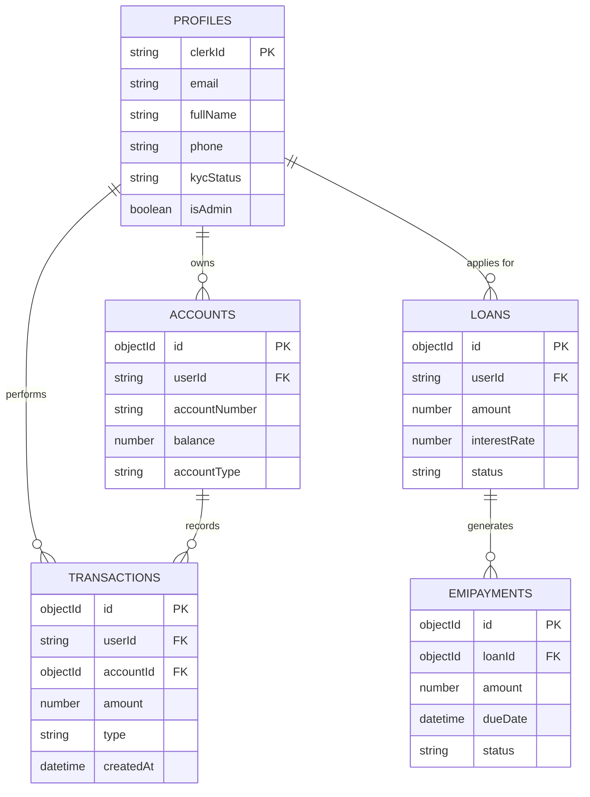

# NexBank: Advanced AI-Driven Banking Solutions
## Project Documentation v1.0

---

## Table of Contents
1.  [Chapter 1: Introduction](#chapter-1-introduction)
    *   1.1 Vision and Mission
    *   1.2 Problem Definition
    *   1.3 Project Objectives
2.  [Chapter 2: System Specification](#chapter-2-system-specification)
    *   2.1 Hardware Requirements
    *   2.2 Software Requirements
    *   2.3 Technical Profile
3.  [Chapter 3: System Design](#chapter-3-system-design)
    *   3.1 Database Design (ER Model)
    *   3.2 Schema Definitions
    *   3.3 Architectural Design
4.  [Chapter 4: Project Description & Modules](#chapter-4-project-description--modules)
    *   4.1 User Module
    *   4.2 Admin Module
    *   4.3 AI Banking Assistant
5.  [Chapter 5: Testing and Implementation](#chapter-5-testing-and-implementation)
    *   5.1 Testing Strategy
    *   5.2 Implementation Pipeline
    *   5.3 Deployment Strategy
6.  [Chapter 6: Conclusion and Future Scope](#chapter-6-conclusion-and-future-scope)

---

## Chapter 1: Introduction

### 1.1 Vision and Mission
NexBank aims to revolutionize the traditional banking experience by integrating cutting-edge Artificial Intelligence with a robust, scalable web architecture. The vision is to provide a seamless, secure, and highly intuitive financial platform where users can manage their wealth effortlessly, and administrators can gain unprecedented insights into their data through natural language interaction.

### 1.2 Problem Definition
Current financial systems often suffer from:
- **Fragmented User Experience**: High friction in transferring funds or applying for loans across different platforms.
- **Data Inaccessibility**: Administrators often need complex SQL knowledge or dedicated data teams to extract simple insights (e.g., "Total deposits this month").
- **Scalability Gaps**: Traditional monolithic architectures struggle to handle peak loads or integrate modern AI modules without significant overhead.
- **Security Vulnerabilities**: Legacy systems often lack real-time monitoring and modern authentication standards.

### 1.3 Project Objectives
- **AI-Powered Analytics**: Enable non-technical administrators to query databases using plain English.
- **Unified Dashboard**: A one-stop interface for all banking needs—deposits, withdrawals, transfers, and loans.
- **Micro-service Readiness**: A modular architecture that separates frontend logic from specialized AI services.
- **Security by Design**: Implementing Clerk for industrial-grade authentication and Stripe for secure, PCI-compliant transactions.

---

## Chapter 2: System Specification

### 2.1 Hardware Requirements

#### 2.1.1 Development Environment
- **Processor**: Intel Core i5/i7 (10th Gen+) or Apple Silicon (M1/M2/M3).
- **RAM**: 16 GB (Recommended for running Docker, Next.js, and Python services simultaneously).
- **Storage**: 256 GB NVMe SSD (minimum).
- **Network**: Stable high-speed internet for API communications (Clerk, Stripe, Gemini).

#### 2.1.2 Production Environment (Cloud)
- **Frontend (Vercel)**: Serverless functions with 1024MB RAM allocation.
- **Backend (Render/Heroku/AWS)**: T2.small instance (2GB RAM) for FastAPI service.
- **Database (MongoDB Atlas)**: M0-M10 Tier with automatic scaling.

#### 2.1.3 End-User Requirements
- **Device**: Any smartphone, tablet, or desktop with a modern browser (Chrome, Firefox, Safari, Edge).
- **RAM**: 4 GB minimum.

### 2.2 Software Requirements
- **Operating System**: Windows 11, macOS Sequoia, or Linux (Ubuntu 22.04+).
- **Programming Languages**:
  - **Frontend**: TypeScript (ES2022+).
  - **Backend**: Python 3.10+.
- **Frameworks**:
  - **UI/UX**: Next.js 16 (App Router), Tailwind CSS 4.0.
  - **API Engine**: FastAPI (Python), Express (Next.js Edge Runtime).
- **Databases**: MongoDB (NoSQL) with Mongoose/PyMongo ODM.
- **AI Model**: Google Gemini 1.5/2.0 Pro/Flash.

### 2.3 Step-by-Step Installation Guide

#### 1. Repository Setup
```bash
git clone https://github.com/your-repo/banking-web-application.git
cd banking-web-application
```

#### 2. Frontend Dependencies (Next.js)
```bash
npm install
# or
pnpm install
```

#### 3. AI Service Setup (Python)
```bash
cd python_service
python -m venv venv
source venv/bin/activate  # On Windows: venv\Scripts\activate
pip install -r requirements.txt
```

#### 4. Environment Configuration
Create a `.env` file in the root directory and populate the following:
```env
# Database
DATABASE_URL=mongodb+srv://...

# Authentication
NEXT_PUBLIC_CLERK_PUBLISHABLE_KEY=pk_test_...
CLERK_SECRET_KEY=sk_test_...

# Payments
STRIPE_SECRET_KEY=sk_test_...
STRIPE_WEBHOOK_SECRET=whsec_...

# AI Service
GEMINI_API_KEY=AIza...
```

#### 5. Running the Application
Use concurrently to start both services:
```bash
npm run dev:all
```

---

## Chapter 3: System Design

### 3.1 Database Design (ER Model)



### 3.2 Schema Definitions

1.  **Profiles Collection**:
    - Stores core user metadata. The `clerkId` acts as the primary link between authentication and application data.
2.  **Transactions Collection**:
    - Each record is immutable. Types include `deposit`, `withdrawal`, `transfer`, `credit`, and `debit`.
3.  **Loans Collection**:
    - Tracks loan lifecycle from `pending` to `approved`, `disbursed`, and finally `closed`.

### 3.3 Architectural Design

The system follows a **Multi-Service Architecture**:
1.  **Client Tier**: Next.js application served via Vercel Edge.
2.  **API Gateway**: Next.js Server Actions and Route Handlers for standard CRUD operations.
3.  **AI Tier**: A specialized Python FastAPI service that communicates with Google Gemini to translate natural language into MongoDB Aggregation Pipelines.
4.  **Data Tier**: MongoDB Atlas for global data persistence.

---

## Chapter 4: Project Description & Modules

### 4.1 User Module
- **Dashboard Overview**: Financial summary cards showing total balance, recent activity, and loan status.
- **Money Transfers**: Internal peer-to-peer transfers using account numbers.
- **Stripe Integration**: Secure balance top-ups using credit/debit cards.
- **Loan Application**: Interactive forms with automated interest rate calculations based on tenure.

### 4.2 Admin Module
- **User Management**: Overview of all registered users and their KYC status.
- **Loan Approval**: Detailed breakdown of loan applications with approval/rejection workflows.
- **Transaction Audit**: Global view of all financial movements across the platform.

### 4.3 AI Banking Assistant
The "NexBot" assistant utilizes advanced **Prompt Engineering**:
- It understands complex queries like "Show me users who deposited more than $5000 in December."
- **Execution Flow**:
  1. User enters natural language.
  2. Next.js sends request to FastAPI.
  3. FastAPI constructs a context-aware prompt with database schemas.
  4. Gemini returns a JSON-formatted MongoDB pipeline.
  5. FastAPI executes the pipeline and sends data back to Next.js for visualization (Tables/Charts).

---

## Chapter 5: Technical Deep Dive: AI Text-to-SQL Engine

### 5.1 The Logic Behind "NexBot"
The core innovation of NexBank is its ability to translate natural language into complex MongoDB aggregation pipelines. This is achieved through a multi-step orchestration:

#### 1. Context Injection
The Python FastAPI service maintains a `SYSTEM_PROMPT` that contains the **full schema** of the MongoDB database. This includes:
- Collection names.
- Field types (Date, ObjectId, Number, String).
- Relationship keys (e.g., `clerkId` as the bridge).

#### 2. Pattern Matching Rules
To ensure accuracy, the AI is instructed on specific banking logic:
- **Deposits**: Identified by regex patterns in the `type` or `description` fields (e.g., `stripe deposit`, `credit`).
- **Date Handling**: The system dynamically calculates relative dates (e.g., "this month" is converted to a range between `2026-01-01` and `2026-02-01`).

#### 3. Security Sanitization
The AI is restricted to returning only specific collections to prevent unauthorized access to sensitive system configurations.

### 5.2 Example Request/Response Cycle

**User Input**: *"Show me the total balance of all savings accounts."*

**AI Generated Pipeline**:
```json
{
  "collection": "accounts",
  "pipeline": [
    { "$match": { "accountType": { "$regex": "savings", "$options": "i" } } },
    { "$group": { "_id": null, "totalBalance": { "$sum": "$balance" } } }
  ]
}
```

---

## Chapter 6: Testing and Quality Assurance

### 6.1 Comprehensive Test Suite

| Test ID | Category | Description | Expected Outcome |
| :--- | :--- | :--- | :--- |
| **TC-001** | Auth | User attempts login with invalid Clerk session. | System redirects to /sign-in with error. |
| **TC-002** | Payment | Stripe Checkout success webhook received. | Account balance increments; Transaction recorded. |
| **TC-003** | AI | Admin asks for "Last 5 withdrawals". | AI returns correct 5 records sorted by date descending. |
| **TC-004** | Loans | User applies for loan without active account. | Application rejected with "Account Required" message. |
| **TC-005** | Security | Script injection attempt in transaction description. | Content sanitized via Zod validation before DB write. |

### 6.2 Performance Benchmarking
- **Page Load (LCP)**: Under 1.5s globally via Vercel Edge.
- **AI Query Latency**: Average 2.1s (Gemini 1.5 Flash).
- **Database Query**: Under 100ms for standard aggregations via MongoDB Atlas indexes.

---

## Chapter 7: Conclusion and Future Scope
NexBank successfully demonstrates the power of AI in fintech. By bridging the gap between complex data structures and natural language, it empowers both users and admins.

**Future Enhancements**:
- **Predictive Analytics**: Using AI to predict user spending patterns.
- **Biometric Security**: FaceID/TouchID integration for mobile banking.
- **Crypto-Integration**: Allowing users to hold and trade digital assets within the NexBank ecosystem.
- **Multi-Currency Support**: Real-time FX rates for international transfers.

---
*End of Documentation*
